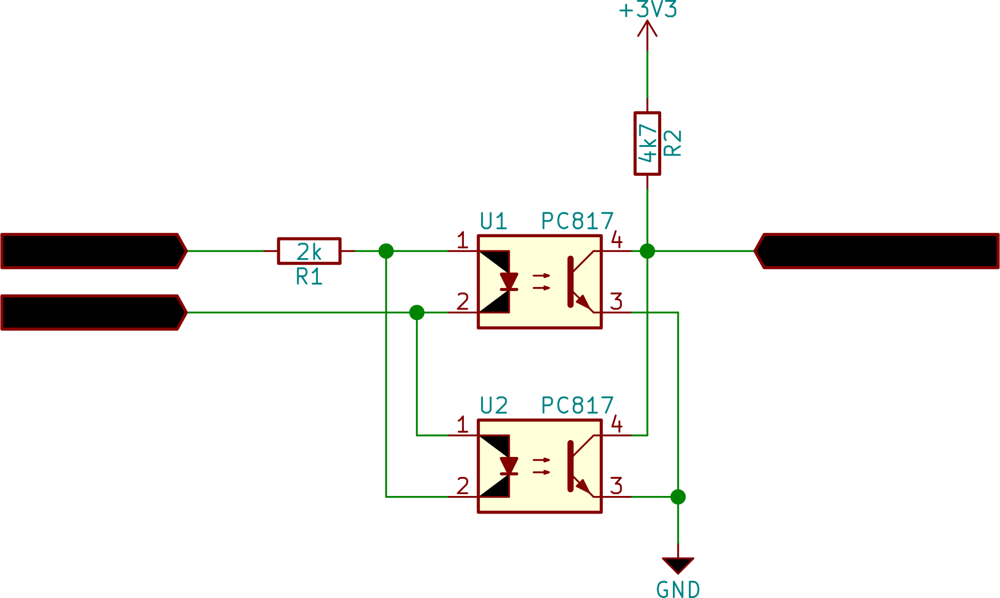

ESP32 door bell to sip call
===========================

On startup the application associates with the compiled in wlan access point and
registers on the SIP server.

Once a signal is detected on the selected GPIO, a call is initiated to a target number. On the phone, the custom string is displayed.
After the configured timeout is elapsed, the call is canceled. If the signal is detected again, before the timer is elapsed, the timer
is started again.

Tested with:

* AVM Fritzbox 7390
* AVM Fritzbox 7490

Programming
-----------

The source code is mixed C and C++. A transition to boost:sml is in progress.

This application is to be used with `Espressif IoT Development Framework`_ (ESP-IDF). It is tested with revision 4f44d16e88cf73dcc4999ca6dab28c44aaeed8db

Please check ESP-IDF docs for getting started instructions.

.. Firmware Details
   ----------------

   @startuml

   title Simple SIP call state diagram
   [*] --> Idle
   Idle --> RegisterUnauth
   RegisterUnauth --> RegisterAuth : / inc sequence number
   RegisterAuth --> Registered : rx 200 / inc seq number
   RegisterAuth --> Error : rx not 200
   Registered --> InviteUnauth : dial request
   InviteUnauth --> InviteUnauthSent : / send invite unauth
   InviteUnauthSent --> InviteAuth: rx 401 or 407 / ack and inc seq number and send invite auth
   InviteUnauthSent --> Ringing : rx 200 or 183
   InviteUnauthSent --> Error : rx unexpected
   InviteAuth --> Error : rx 401 or 407 or unexpected
   InviteAuth --> Ringing : rx 200 or 183 or 100
   Ringing --> Ringing : rx 183
   Ringing --> CallStart : rx 200
   Ringing --> Cancelled : rx 487
   Ringing --> InviteAuth : rx 407 / sip ack and inc seq number
   Ringing --> Registered : rx 603 / ack and seq_num++
   Ringing --> Cancelled : cancel request / send cancel
   CallStart --> CallInProgress
   CallInProgress --> Cancelled : cancel request / send cancel
   CallInProgress --> Registered : rx bye / seq++
   Cancelled --> Registered : rx 200 / seq++
   
   Error --> Idle : 2000msec timeout / inc sequence number
   
   @enduml

Hardware
--------

An ESP32 board can be used. Only one external GPIO (input is sufficient) must be available, to detect the call trigger.
To test this, two PC817 opto coupler are used to detect the AC signal (about 12V from the bell transformer). The input diode of the opto couplers are connected in parallel and opposing directions.
In series, a 2k Resistor is used. This may have to be tweaked according to the input voltage.
The output transistors of the opto couplers are connected in parallel in the same polarity to pull the signal to ground, if a current flows through one of the input diodes. A pull up resistor (either internal in the ESP32 or external) must be used to pull the signal to 3V3 if no input current is detected and the output transistors are switched off.

If the bell transformer delivers enough power, the ESP32 can be powered from it. A bridge rectifier, a big capacitor and a cheap switching regulator board can be used for that.

License
-------

If not otherwise specified, code in this repository is Copyright (C) 2017 Christian Taedcke <hacking@taedcke.com>, licensed under the Apache License 2.0 as described in the file LICENSE.

Misc Information
----------------

On the AVM Fritzbox the number \*\*9 can be used to let all connected phones ring.

.. _`Espressif IoT Development Framework`: https://esp-idf.readthedocs.io/
